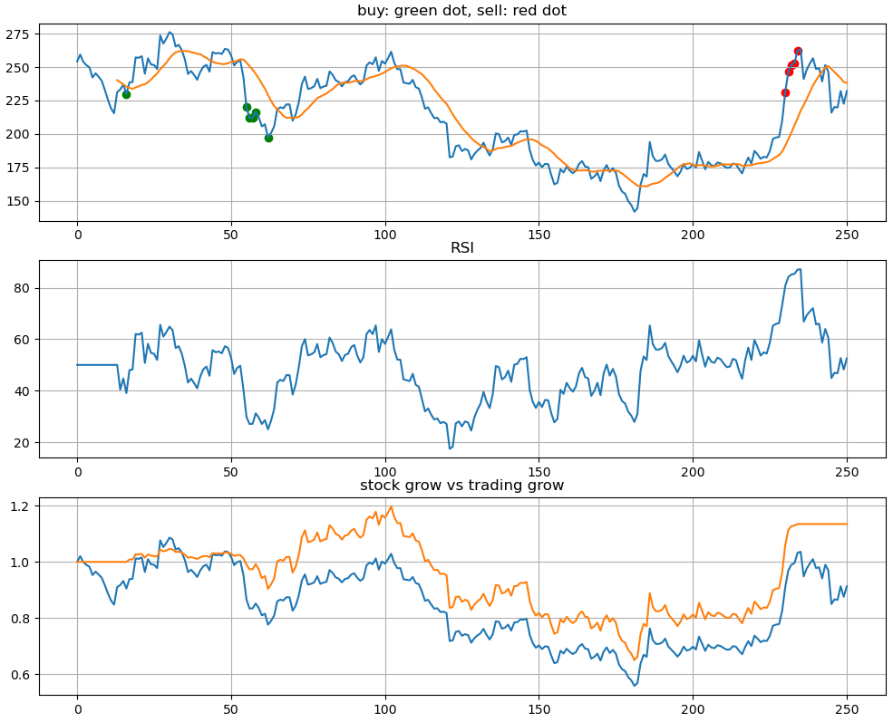
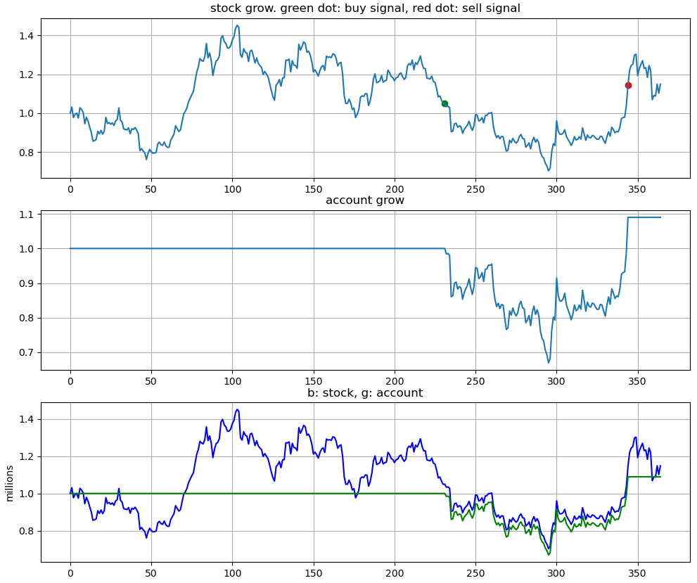

Use Visual Studio Code to run program. 
Select Python interpreter: Open the Command Palette ( Ctrl+Shift+P ), type Python: Select Interpreter , and hit Enter.

To download stock price history:
https://finance.yahoo.com/quote/MSFT/history/
https://finance.yahoo.com/quote/TSLA/history/
Adjusted close price adjusted for splits and dividend and/or capital gain distributions.

